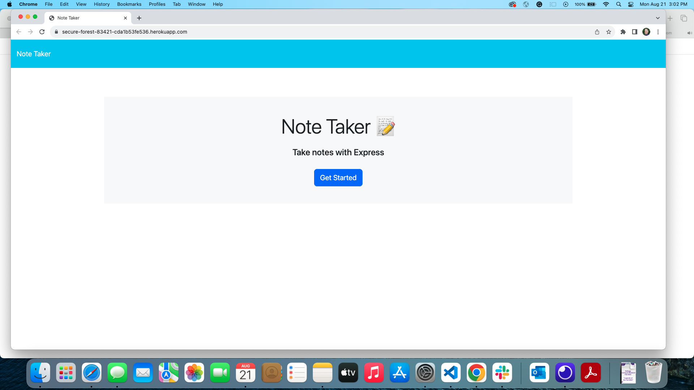

# Note Taker

## Description

This application is a simple note taker that uses express.js back end and will save and retrieve note data from a JSON file

## Technologies used

-------------------------------------------------------------

## Table of Contents

* [Installation](#installation)

* [Usage](#usage)

* [License](#license)

* [Contributions](#contributions)

* [Questions](#questions)

## Installation

To install the program, run the following command:

You will need to have Node

## Usage

1. Click on the "Get started" button 
2. Fill in a title and text you want to save
3. When both fields are filled out, click on the save icon in the upper right
4. You can continue to add as many notes as you would like

## License

This application is covered under the MIT License license.
[License URL](https://opensource.org/licenses/MIT)

## Contributions

EdX provided the starter code [Link to code](https://github.com/coding-boot-camp/miniature-eureka). I have GitHub co-pilot installed to help speed up my code and to rediuse errors

## Screenshots

### Homepage

### Initial Notes page

### Updated Notes page after item is saved

## Application URL
[Link to application URL](https://github.com/sthogue/Note-Taker)

## Questions

View more of my work at
[https://github.com/sthogue](https://github.com/sthogue/)

Email me with any questions at
sthogue16@gmail.com

